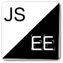

#  Earth Engine Connector
Run local NodeJS scripts using CommonJS modules in the Earth Engine playground.

## Requirements

 - [NodeJS (& NPM)](http://nodejs.org/)
 - Google Chrome

## Initial Install

[Quick Start Video](https://youtu.be/EBqHQrLUKjs)

First, you will need the Earth Engine connector file server. Install via NPM.

```bash
> npm install -g earthengine-connector
```

Second, you need the [Earth Engine Connector Google Chrome Plugin.](https://chrome.google.com/webstore/detail/earth-engine-connector/dojghogmelnchlebnpncaclgljkkmcgf)
Click the link to install.

## Setup

Now start the up the server in the directory where your local
Earth Engine scripts live.  Alternatively you can pass a directory
to the server as the first argument. 

```
> js-ee [dir]
```

You can test the server is working by visiting [http://127.0.0.1:9812](http://127.0.0.1:9812)
in your browser.


## Usage

Visit [http://code.earthengine.google.com](http://code.earthengine.google.com)
with the Chrome extension installed and js-ee server running.  There are some 
examples tutorial scripts in the **examples** dir you can serve with js-ee for testing.

At the bottom right corner for the Earth Engine playground you should see a upload 
icon button.  Click it to see all files from the directory you are serving.  
Click any file to load.

At any time you and reload the file list by clicking the refresh icon below
the file list.  You can refresh a loaded file by clicking the main refresh icon
next to the upload icon.  This icon only shows after a file is loaded and the 
file selector window is closed.

## Writing scripts

You are now free to break your EE scripts into multiple files using the NodeJS
require() function to import other files.  You can pull and publish to NPM as well,
though be warned, all imported JS code needs to be able to run inside the EE 
playground.  Finally, you can now store your scripts in Github, Bitbucket or other
common code repositories.

## Connection Issues

If [http://127.0.0.1:9812](http://127.0.0.1:9812) is loading but your are still see
the message **Error connecting the JS-EE server**, check the right side of the address
bar.  If you see a shield with a slash through it, click the icon and allow mixed content
to load.
